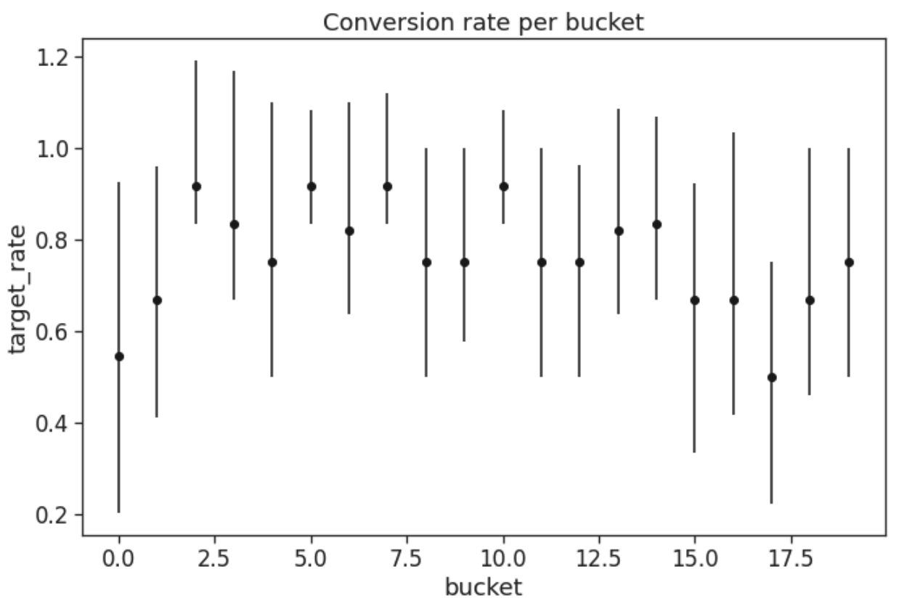
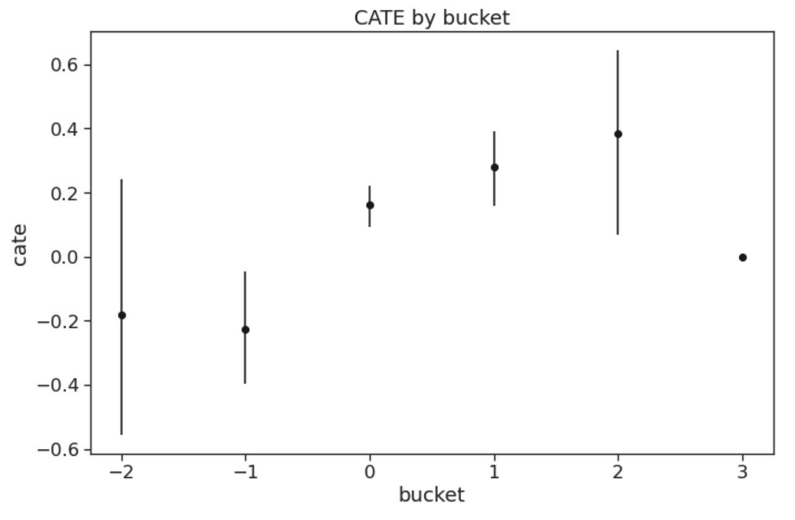
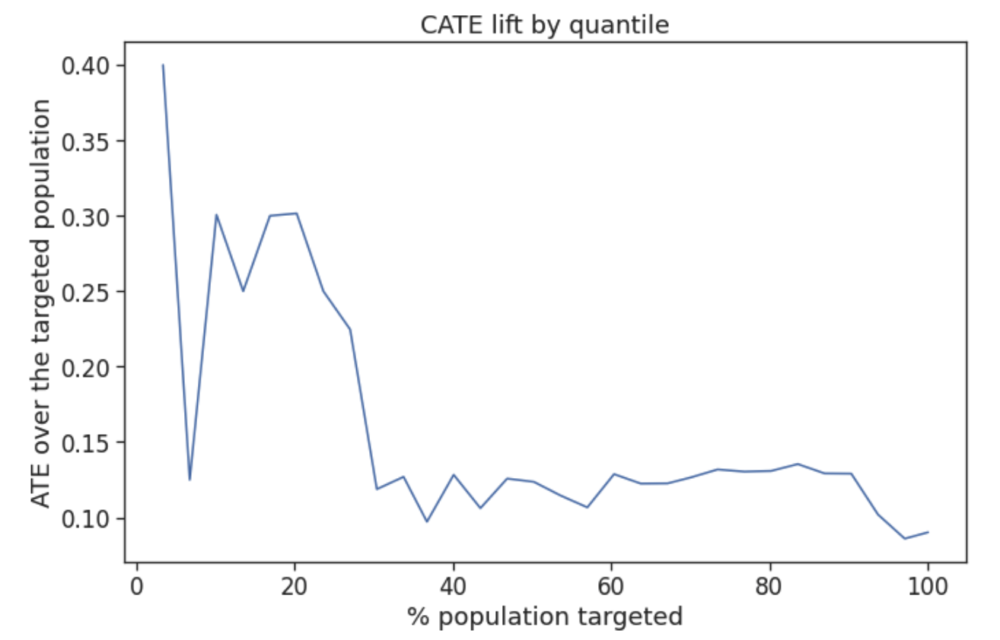
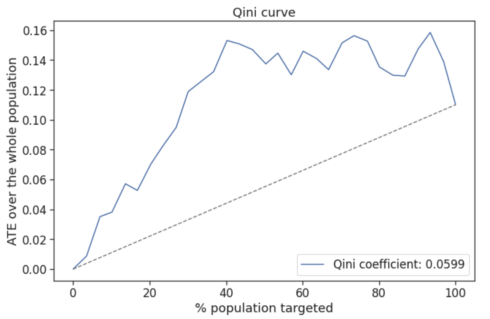
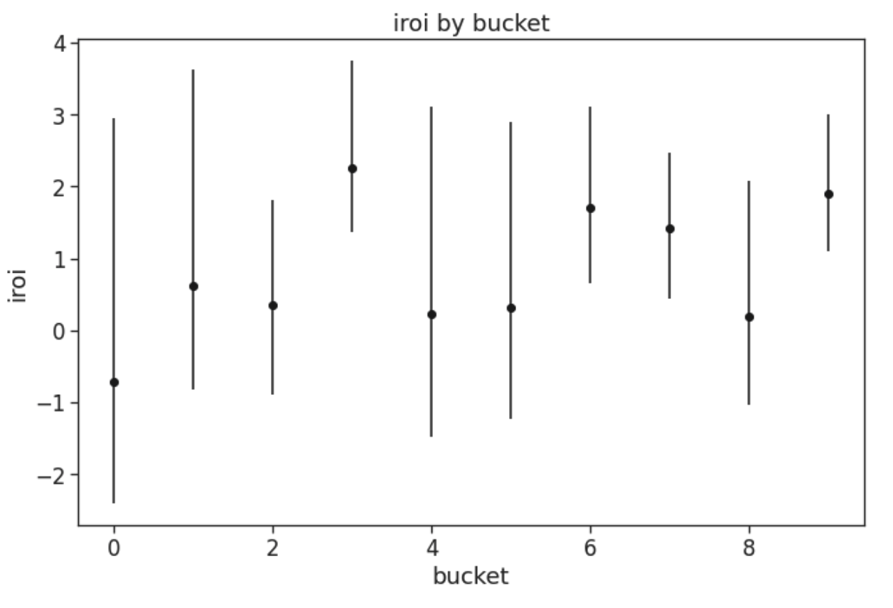
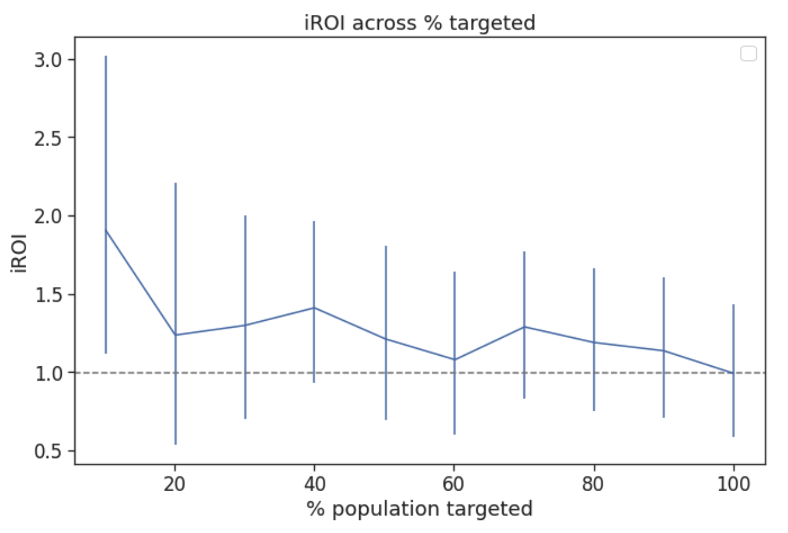

Evaluation
================================================

Key metrics
--------------------------------------
UpliftML provides functions for estimating the following key business metrics.

**Target rate** - the expected value of our target variable, :math:`E[Y]`.
Estimated as the mean, :math:`\frac{\sum_i^n{y_i}}{n}`.

**Average treatment effect (ATE)** - the overall causal effect of the treatment, :math:`E[Y(1) - Y(0)]`
Assuming randomized treatment assignment in the data under study, this is equivalent to the estimand :math:`E[Y|T=1]-E[Y|T=0]`.
This estimand can be estimated as the difference in the target rates between the treated and control groups:

.. math::
    \frac{\sum_i^n{y_i \cdot t_i}}{\sum_i^n{t_i}} - \frac{\sum_i^n{y_i \cdot (1 - t_i)}}{\sum_i^n{1 - t_i}}.

**Return on investment (ROI)** - expresses the (monetary) benefit gained per unit of spend, :math:`E[\frac{benefit}{cost}]`.
Estimated as:

.. math::
    \frac{\sum_i^n{benefit_i}}{\sum_i^n{cost_i}}.

**Incremental ROI (iROI)** - expresses the incremental (i.e., additional) benefit gained due to the treatment, per unit of incremental spend incurred by the treatment,

.. math::
    E[\frac{benefit\_with\_treatment - benefit\_without\_treatment}{cost\_with\_treatment - cost\_without\_treatment}].

Estimated as:

.. math::
    \frac{\sum_i^n{benefit_i \cdot t_i} - sf \cdot \sum_i^n{benefit_i \cdot (1 - t_i)}}{\sum_i^n{cost_i \cdot t_i} - sf \cdot \sum_i^n{cost_i \cdot (1 - t_i)}},

where :math:`sf` is the scale factor accounting for the difference in sizes between the treated and control groups,
:math:`sf = \frac{\sum_i^n{t_i}}{\sum_i^n{1 - t_i}}`

Plots
--------------------------------------

**Target rate per bucket/quantile curve**

Plots the target rate within pre-determined buckets (i.e., categories) or quantile ranges.

**CATE per bucket/quantile curve**

Plots the treatment effect within pre-determined buckets (i.e., categories) or quantile ranges.

**CATE lift curve**

Orders the instances based on a specified score from highest to lowest, then plots the treatment effect cumulatively per quantile.
For instance, CATE lift at 20% of population targeted corresponds to CATE among instances with top 20% highest scores.

**Uplift/Qini curve** :cite:p:`radcliffe2011real`

Orders the instances based on a specified score from highest to lowest, then plots the cumulative incremental gain, normalized to the overall population size, per quantile.
The diagonal line represents the cumulative incremental gain under random treatments.

For instance, Qini at 20% of population targeted corresponds to the total incremental gain if we treat only the instances with top 20% highest scores.
In the plot below, the curve starts to converge around 40% of targeted population, which indicates that treating more instances than that will not increase our total gain.

**iROI per bucket/quantile curve**

Plots the incremental ROI within pre-determined buckets (i.e., categories) or quantile ranges.

**Cumulative iROI curve**

Orders the instances based on a specified score from highest to lowest, then plots the iROI cumulatively per quantile.
The horizontal line represents the overall iROI in the whole dataset.

For instance, iROI at 20% of population targeted corresponds to iROI among instances with top 20% highest scores.

Model evaluation metrics
--------------------------------------

**Area under the uplift curve (AUUC)** - the uplift/Qini curve presented above can be aggregated into a single metric by computing the area under the curve.

**Qini coefficient** :cite:p:`radcliffe2011real` - AUUC divided by the area under the random targeting curve.